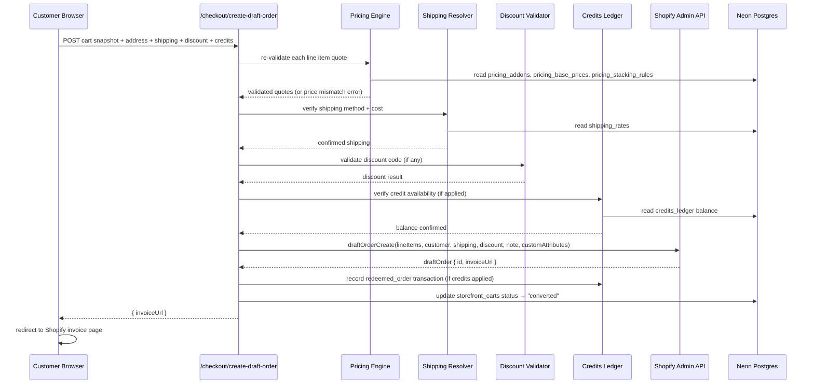
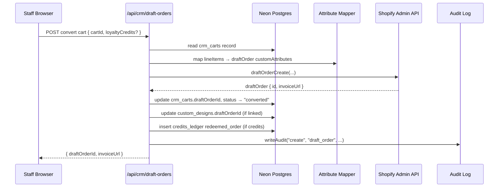

# Design Document — Cart & Draft Orders

## Overview

This feature adds two complementary purchase flows to Lunettiq:

1. **CRM Staff Cart Builder** — staff build carts for clients, convert to Shopify Draft Orders via Admin API, manage product setup. Extends the existing `shopify-admin.ts` write-through layer with GraphQL mutations for `draftOrderCreate`, `draftOrderComplete`, `draftOrderDelete`, and `productCreate`.

2. **Storefront Custom Cart & Draft Order Checkout** — a custom cart (separate from the existing Storefront API cookie cart in `CartContext.tsx`) where each line item is a configured eyewear pair with CRM pricing engine quotes. Checkout creates a Draft Order and redirects to Shopify's invoice page.

3. **Shared Infrastructure** — Shopify Admin GraphQL client with retry/backoff, pricing engine (addon catalog + stacking rules + base prices), shipping rate resolver, discount validator, line-item attribute round-trip, and anonymous-to-account cart migration.

### Key Architectural Decisions

- **No Shopify Plus** — Storefront API cart coexists but checkout uses Draft Orders via Admin API.
- **Shopify = catalogue + inventory + payment + final orders.** CRM = pricing rules, Rx, loyalty, segments, quote engine. Frontend = PDP, configurator, cart, checkout orchestration.
- **Each frame colour = its own Shopify product.** No lens-feature variants for optical. Sunglasses variants only for visually merchandised tint/polarization.
- **All lens-service uplifts computed by CRM pricing engine**, not Shopify line item prices.
- **Existing `shopify-admin.ts`** already has REST + GraphQL helpers with `AdminResult<T>` pattern — new Admin API mutations extend this module rather than creating a parallel client.
- **Conditional integration** — all Admin API code gated on `SHOPIFY_ADMIN_API_ACCESS_TOKEN` availability per architecture rules.
- **Pricing is DB-driven** — addons, stacking rules, base prices, and shipping rates all stored in Postgres, manageable from CRM settings.

## Architecture

### System Boundary Diagram

```mermaid
graph TB
    subgraph Storefront["Storefront (Next.js)"]
        PDP[PDP / Configurator]
        SCart[Custom Cart Page]
        Checkout[Checkout Orchestrator]
    end

    subgraph CRM["CRM (Next.js)"]
        CartBuilder[Cart Builder UI]
        ProductSetup[Product Setup Form]
        AddonMgmt[Addon Management]
        DraftMgmt[Draft Order Management]
    end

    subgraph API["API Layer (Next.js Route Handlers)"]
        CartAPI["/api/cart/*"]
        CheckoutAPI["/checkout/create-draft-order"]
        PricingAPI["/api/cart/pricing-quote"]
        ShippingAPI["/api/cart/shipping-options"]
        DiscountAPI["/api/cart/validate-discount"]
        CrmCartAPI["/api/crm/carts"]
        CrmDraftAPI["/api/crm/draft-orders"]
        CrmProductAPI["/api/crm/products (existing)"]
        SettingsAPI["/api/crm/settings/pricing-*"]
        WebhookAPI["/api/webhooks/shopify"]
    end

    subgraph Services["Service Layer"]
        AdminClient[Shopify Admin Client]
        PricingEngine[Pricing Engine]
        ShippingResolver[Shipping Resolver]
        DiscountValidator[Discount Validator]
        AttributeMapper[Attribute Mapper]
    end

    subgraph Storage["Storage"]
        DB[(Neon Postgres)]
        LS[localStorage]
        ShopifyAPI[Shopify Admin API]
    end

    PDP --> PricingAPI
    SCart --> CartAPI
    SCart --> ShippingAPI
    SCart --> DiscountAPI
    Checkout --> CheckoutAPI

    CartBuilder --> CrmCartAPI
    ProductSetup --> CrmProductAPI
    AddonMgmt --> SettingsAPI
    DraftMgmt --> CrmDraftAPI

    CheckoutAPI --> AdminClient
    CheckoutAPI --> PricingEngine
    CrmDraftAPI --> AdminClient
    CrmProductAPI --> AdminClient

    PricingAPI --> PricingEngine
    ShippingAPI --> ShippingResolver
    DiscountAPI --> DiscountValidator

    AdminClient --> ShopifyAPI
    PricingEngine --> DB
    ShippingResolver --> DB
    CrmCartAPI --> DB
    WebhookAPI --> DB

    SCart --> LS
    SCart --> DB
```



### Module Layout

```
src/lib/shopify/admin.ts          — Admin GraphQL client (retry/backoff, conditional)
src/lib/shopify/admin-mutations.ts — draftOrderCreate, draftOrderComplete, draftOrderDelete, productCreate
src/lib/shopify/admin-errors.ts    — AdminApiError, AdminRateLimitError
src/lib/pricing/engine.ts          — quote computation, addon resolution, stacking validation
src/lib/pricing/stacking.ts        — stacking rule evaluator (pure function)
src/lib/pricing/types.ts           — PricingAddon, StackingRule, Quote, BasePriceConfig
src/lib/cart/attribute-mapper.ts   — CRM cart ↔ Draft Order attribute round-trip
src/lib/cart/storefront-cart.ts    — Storefront custom cart types + persistence helpers
src/lib/cart/migration.ts          — anonymous → account cart merge logic
src/lib/shipping/resolver.ts       — DB-driven shipping rate lookup
src/lib/discount/validator.ts      — discount code validation against Shopify + credit compat
```

### Data Flow: Storefront Checkout



### Data Flow: CRM Cart → Draft Order




## Components and Interfaces

### 1. Shopify Admin GraphQL Client (`src/lib/shopify/admin.ts`)

Extends the existing `shopify-admin.ts` pattern but adds retry/backoff matching the Storefront client. The existing module uses REST + GraphQL without retry — the new client wraps GraphQL-only with exponential backoff for 429/5xx.

```typescript
// Conditional — no-ops when token absent
export async function adminGraphqlFetch<T>(
  query: string,
  variables?: Record<string, unknown>
): Promise<AdminResult<T>>

// Config
const MAX_RETRIES = 3;
const BASE_DELAY_MS = 500;
// Retry on 429 and 5xx, exponential backoff: 500ms, 1000ms, 2000ms
```

**Decision:** Extend `src/lib/crm/shopify-admin.ts` rather than create a new file. Add retry logic to the existing `graphqlFetch` helper. The existing `restFetch` stays as-is (used for customer CRUD). New mutations go in a separate `admin-mutations.ts` file to keep the module focused.

**Conditional gate:** Check `getToken()` — if null/undefined, return `{ ok: false, error: 'Admin API not configured' }` immediately.

### 2. Admin API Mutations (`src/lib/shopify/admin-mutations.ts`)

```typescript
// Draft Orders
export async function draftOrderCreate(input: DraftOrderInput): Promise<AdminResult<DraftOrder>>
export async function draftOrderComplete(id: string): Promise<AdminResult<CompletedOrder>>
export async function draftOrderDelete(id: string): Promise<AdminResult<void>>

// Products
export async function productCreate(input: ProductCreateInput): Promise<AdminResult<CreatedProduct>>
export async function collectionAddProducts(collectionId: string, productIds: string[]): Promise<AdminResult<void>>

// Types
interface DraftOrderInput {
  lineItems: DraftOrderLineItem[];
  customerId: string;          // Shopify GID
  note?: string;
  shippingAddress?: ShopifyAddress;
  shippingLine?: { title: string; price: string };
  appliedDiscount?: { value: number; valueType: 'FIXED_AMOUNT' | 'PERCENTAGE'; title: string };
  tags?: string[];
}

interface DraftOrderLineItem {
  variantId?: string;          // Shopify GID — null for reglaze custom items
  title?: string;              // required when variantId absent (reglaze)
  quantity: number;
  originalUnitPrice?: string;  // override price from pricing engine
  customAttributes: Array<{ key: string; value: string }>;
}

interface DraftOrder {
  id: string;                  // Shopify GID
  invoiceUrl: string;
  name: string;                // e.g. "#D1234"
  status: string;
  totalPrice: string;
}
```

### 3. Pricing Engine (`src/lib/pricing/engine.ts`)

Pure-function core with DB reads at the boundary.

```typescript
// Public API
export async function computeQuote(input: QuoteInput): Promise<QuoteResult>
export async function validateConfiguration(input: ConfigValidationInput): Promise<ValidationResult>

// Pure functions (testable)
export function resolveAddons(selectedSlugs: string[], availableAddons: PricingAddon[]): ResolvedAddon[]
export function evaluateStackingRules(selectedSlugs: string[], rules: StackingRule[]): StackingViolation[]
export function computeTotal(basePrice: number, resolvedAddons: ResolvedAddon[]): number

interface QuoteInput {
  productContext: 'optical' | 'sunglasses' | 'reglaze';
  selectedAddonSlugs: string[];
  customerId?: string;         // for loyalty price adjustments
}

interface QuoteResult {
  quoteId: string;             // UUID
  basePrice: number;
  addonBreakdown: Array<{ slug: string; displayName: string; price: number }>;
  total: number;
  productContext: string;
  computedAt: string;          // ISO timestamp
}

interface StackingViolation {
  ruleType: 'exclusive_group' | 'requires' | 'incompatible';
  conflictingSlugs: string[];
  description: string;
}
```

### 4. Stacking Rule Evaluator (`src/lib/pricing/stacking.ts`)

Pure function — no DB access. Takes rules + selected slugs, returns violations.

```typescript
export function evaluateStackingRules(
  selectedSlugs: string[],
  rules: StackingRule[]
): StackingViolation[]
```

**Rule evaluation logic:**
- `exclusive_group`: if >1 slug from `addonSlugs` is in `selectedSlugs` → violation
- `requires`: if first slug in `addonSlugs` is selected but second is not → violation
- `incompatible`: if any 2 slugs from `addonSlugs` are both in `selectedSlugs` → violation

### 5. Attribute Mapper (`src/lib/cart/attribute-mapper.ts`)

Round-trip mapping between CRM cart line items and Shopify draft order `customAttributes`. Extends the existing `serializeConfig`/`deserializeConfig` in `src/lib/configurator/serialize.ts`.

```typescript
export function cartLineToCustomAttributes(line: CrmCartLineItem): Array<{ key: string; value: string }>
export function customAttributesToCartLine(attrs: Array<{ key: string; value: string }>): Partial<CrmCartLineItem>

// Keys: _lensType, _lensIndex, _coatings, _rxStatus, _rxReference, _quoteId, _productContext
```

**Round-trip property:** `customAttributesToCartLine(cartLineToCustomAttributes(line))` produces equivalent attribute values for all mapped keys.

### 6. Shipping Resolver (`src/lib/shipping/resolver.ts`)

```typescript
export async function resolveShippingOptions(
  address: ShippingAddress
): Promise<ShippingOption[]>

export function classifyRegion(countryCode: string): 'canada' | 'us' | 'international'

interface ShippingOption {
  id: string;
  region: string;
  displayName: string;
  price: number;
  currency: string;
}
```

Reads from `shipping_rates` table. `classifyRegion` is a pure function mapping ISO country codes → region slugs.

### 7. Discount Validator (`src/lib/discount/validator.ts`)

```typescript
export async function validateDiscount(input: DiscountValidationInput): Promise<DiscountResult>

interface DiscountValidationInput {
  code: string;
  cartSnapshot: CartSnapshot;
  customerId?: string;
  appliedCredits?: number;
}

interface DiscountResult {
  valid: boolean;
  reason?: string;
  discountAmount?: number;
  newSubtotal?: number;
  newTotal?: number;
}
```

### 8. Storefront Custom Cart Context (`src/context/StorefrontCartContext.tsx`)

Separate from existing `CartContext.tsx` (which manages the Storefront API cookie cart). This context manages the custom configured-eyewear cart.

```typescript
interface StorefrontCartLineItem {
  id: string;                  // client-generated UUID
  shopifyProductId?: string;   // null for reglaze
  shopifyVariantId?: string;   // null for reglaze
  productHandle?: string;
  title: string;
  image?: string;
  productContext: 'optical' | 'sunglasses' | 'reglaze';
  configuration: ConfigurationSnapshot;
  quoteId: string;
  rxReference?: string;
  quantity: number;
  unitTotal: number;
}

interface StorefrontCartState {
  items: StorefrontCartLineItem[];
  shippingAddress?: ShippingAddress;
  selectedShipping?: ShippingOption;
  discountCode?: string;
  discountResult?: DiscountResult;
  appliedCredits?: number;
  subtotal: number;
  total: number;
}
```

**Persistence strategy:**
- Anonymous: `localStorage` key `lunettiq_custom_cart`
- Logged-in: `POST /api/cart/sync` writes to `storefront_carts` table, reads on page load
- Migration on login: merge localStorage → server, clear localStorage

### 9. CRM Cart Builder Component (`src/app/crm/carts/CartBuilder.tsx`)

Client component. Product search uses existing `/api/crm/products` endpoint. Cart state persisted to `crm_carts` table via `/api/crm/carts` API.

Key interactions:
- Search products → select variant → add line item
- Edit quantity, apply line discount, attach custom attributes (lens type, index, coatings, Rx)
- Associate client (required before conversion)
- Convert to draft order → calls `/api/crm/draft-orders`

### 10. CRM Addon Management (`src/app/crm/settings/pricing-addons/`)

CRUD UI for `pricing_addons` table. Tabbed by product context (optical / sunglasses / reglaze). Drag-to-reorder. Deactivate instead of delete.

### 11. CRM Stacking Rules Management (`src/app/crm/settings/pricing-rules/`)

CRUD UI for `pricing_stacking_rules` table. Visual display of rule groups. Validation preview.

### 12. API Route Handlers

| Route | Method | Auth | Purpose |
|-------|--------|------|---------|
| `/api/crm/carts` | GET/POST/PUT | `org:orders:write` | CRM cart CRUD |
| `/api/crm/carts/[id]` | GET/DELETE | `org:orders:write` | Single cart ops |
| `/api/crm/draft-orders` | POST | `org:orders:write` | Convert cart → draft order |
| `/api/crm/draft-orders/[id]/complete` | POST | `org:orders:write` | Mark draft order paid |
| `/api/crm/draft-orders/[id]/cancel` | POST | `org:orders:write` | Cancel + credit reversal |
| `/api/crm/settings/pricing-addons` | GET/POST/PUT | `org:settings:write` | Addon CRUD |
| `/api/crm/settings/pricing-rules` | GET/POST/PUT | `org:settings:write` | Stacking rule CRUD |
| `/api/crm/settings/pricing-base` | GET/POST | `org:settings:write` | Base price management |
| `/api/crm/settings/shipping-rates` | GET/POST/PUT | `org:settings:write` | Shipping rate CRUD |
| `/api/cart/pricing-quote` | POST | public | Compute pricing quote |
| `/api/cart/shipping-options` | POST | public | Resolve shipping options |
| `/api/cart/validate-discount` | POST | public | Validate discount code |
| `/api/cart/sync` | POST | auth | Sync storefront cart to server |
| `/api/cart/migrate` | POST | auth | Merge anonymous → account cart |
| `/checkout/create-draft-order` | POST | public* | Create draft order for checkout |
| `/api/webhooks/shopify` | POST | webhook | Draft order completion webhook |

*Checkout endpoint validates cart integrity server-side; no CRM auth required but cart must be valid.


## Data Models

### New Database Tables

All tables use Drizzle ORM with Neon Postgres, following existing schema patterns in `src/lib/db/schema.ts`.

#### `crm_carts`

Staff-built carts persisted server-side.

```typescript
export const crmCartStatusEnum = pgEnum('crm_cart_status', ['draft', 'converted', 'abandoned']);

export const crmCarts = pgTable('crm_carts', {
  id: uuid('id').defaultRandom().primaryKey(),
  staffId: text('staff_id').notNull(),
  shopifyCustomerId: text('shopify_customer_id'),  // nullable until client associated
  lineItems: jsonb('line_items').notNull().$type<CrmCartLineItem[]>(),
  discounts: jsonb('discounts').$type<CrmCartDiscount[]>(),
  note: text('note'),
  status: crmCartStatusEnum('status').default('draft'),
  draftOrderId: text('draft_order_id'),
  draftOrderInvoiceUrl: text('draft_order_invoice_url'),
  appliedCredits: decimal('applied_credits', { precision: 12, scale: 2 }),
  createdAt: timestamp('created_at', { withTimezone: true }).defaultNow(),
  updatedAt: timestamp('updated_at', { withTimezone: true }).defaultNow(),
}, (t) => [
  index('idx_crm_carts_staff').on(t.staffId),
  index('idx_crm_carts_customer').on(t.shopifyCustomerId),
  index('idx_crm_carts_status').on(t.status),
]);

// JSONB types
interface CrmCartLineItem {
  id: string;                  // client-generated UUID
  shopifyProductId?: string;
  shopifyVariantId?: string;
  productHandle?: string;
  title: string;
  variantTitle?: string;
  image?: string;
  quantity: number;
  unitPrice: number;           // original variant price or pricing engine quote
  lineDiscount?: { type: 'percentage' | 'fixed'; value: number };
  lineTotal: number;
  customAttributes: Array<{ key: string; value: string }>;
  quoteId?: string;
  productContext?: 'optical' | 'sunglasses' | 'reglaze';
}

interface CrmCartDiscount {
  type: 'percentage' | 'fixed';
  value: number;
  reason?: string;
}
```

#### `storefront_carts`

Server-side persistence for logged-in storefront customers.

```typescript
export const storefrontCarts = pgTable('storefront_carts', {
  id: uuid('id').defaultRandom().primaryKey(),
  shopifyCustomerId: text('shopify_customer_id').notNull(),
  lineItems: jsonb('line_items').notNull().$type<StorefrontCartLineItem[]>(),
  status: text('status').default('active'),  // 'active' | 'converted' | 'abandoned'
  draftOrderId: text('draft_order_id'),
  createdAt: timestamp('created_at', { withTimezone: true }).defaultNow(),
  updatedAt: timestamp('updated_at', { withTimezone: true }).defaultNow(),
}, (t) => [
  index('idx_storefront_carts_customer').on(t.shopifyCustomerId),
]);
```

#### `pricing_addons`

CRM-managed addon catalog.

```typescript
export const addonCategoryEnum = pgEnum('addon_category', [
  'lens_type', 'thinning', 'coating', 'tint', 'service',
]);

export const productContextEnum = pgEnum('product_context', [
  'optical', 'sunglasses', 'reglaze',
]);

export const pricingAddons = pgTable('pricing_addons', {
  id: uuid('id').defaultRandom().primaryKey(),
  slug: text('slug').notNull(),
  displayName: text('display_name').notNull(),
  description: text('description'),
  price: decimal('price', { precision: 12, scale: 2 }).notNull(),
  productContext: productContextEnum('product_context').notNull(),
  category: addonCategoryEnum('category').notNull(),
  active: boolean('active').default(true),
  sortOrder: integer('sort_order').default(0),
  createdAt: timestamp('created_at', { withTimezone: true }).defaultNow(),
  updatedAt: timestamp('updated_at', { withTimezone: true }).defaultNow(),
}, (t) => [
  uniqueIndex('idx_pricing_addons_slug').on(t.slug),
  index('idx_pricing_addons_context').on(t.productContext),
]);
```

#### `pricing_stacking_rules`

Addon combination rules.

```typescript
export const stackingRuleTypeEnum = pgEnum('stacking_rule_type', [
  'exclusive_group', 'requires', 'incompatible',
]);

export const pricingStackingRules = pgTable('pricing_stacking_rules', {
  id: uuid('id').defaultRandom().primaryKey(),
  ruleType: stackingRuleTypeEnum('rule_type').notNull(),
  addonSlugs: text('addon_slugs').array().notNull(),
  productContext: productContextEnum('product_context'),  // null = applies to all
  description: text('description'),
  active: boolean('active').default(true),
  createdAt: timestamp('created_at', { withTimezone: true }).defaultNow(),
}, (t) => [
  index('idx_stacking_rules_context').on(t.productContext),
]);
```

#### `pricing_base_prices`

Historical base prices per product context.

```typescript
export const pricingBasePrices = pgTable('pricing_base_prices', {
  id: uuid('id').defaultRandom().primaryKey(),
  productContext: productContextEnum('product_context').notNull(),
  price: decimal('price', { precision: 12, scale: 2 }).notNull(),
  currency: text('currency').default('CAD'),
  active: boolean('active').default(true),
  effectiveFrom: timestamp('effective_from', { withTimezone: true }).defaultNow(),
  createdAt: timestamp('created_at', { withTimezone: true }).defaultNow(),
}, (t) => [
  index('idx_base_prices_context').on(t.productContext, t.active),
]);
```

#### `shipping_rates`

DB-driven shipping rates.

```typescript
export const shippingRates = pgTable('shipping_rates', {
  id: uuid('id').defaultRandom().primaryKey(),
  region: text('region').notNull(),              // 'canada', 'us', 'international'
  displayName: text('display_name').notNull(),
  price: decimal('price', { precision: 12, scale: 2 }).notNull(),
  currency: text('currency').default('CAD'),
  active: boolean('active').default(true),
  sortOrder: integer('sort_order').default(0),
  createdAt: timestamp('created_at', { withTimezone: true }).defaultNow(),
  updatedAt: timestamp('updated_at', { withTimezone: true }).defaultNow(),
}, (t) => [
  index('idx_shipping_rates_region').on(t.region),
]);
```

### Seed Data

**Base Prices:**
| Context | Price | Currency |
|---------|-------|----------|
| optical | 290.00 | CAD |
| sunglasses | 250.00 | CAD |

**Shipping Rates:**
| Region | Display Name | Price | Currency |
|--------|-------------|-------|----------|
| canada | Standard Shipping (Canada) | 35.00 | CAD |
| us | Standard Shipping (US) | 45.00 | CAD |
| international | International Shipping | 59.00 | CAD |

**Optical Addons (on top of $290 base):**
| Slug | Display Name | Price | Category |
|------|-------------|-------|----------|
| progressive-premium | Progressive Premium | 275.00 | lens_type |
| computer-degressive | Computer/Degressive | 275.00 | lens_type |
| super-progressive | Super Progressive | 500.00 | lens_type |
| anti-fatigue | Anti-Fatigue | 90.00 | lens_type |
| thinning-1-6 | Thinning 1.6 | 60.00 | thinning |
| ultra-thin-1-67 | Ultra Thin 1.67 | 100.00 | thinning |
| super-thin-1-74 | Super Thin 1.74 | 200.00 | thinning |
| blue-light | Blue Light | 75.00 | coating |
| blue-light-no-rx | Blue Light no Rx | 10.00 | coating |
| rx-with-tint | Prescription with Tint | 120.00 | tint |
| rx-with-polarized | Prescription with Polarized | 180.00 | tint |
| transitions | Transitions | 180.00 | coating |
| interior-tint | Interior Tint | 160.00 | tint |

**Sunglasses Addons (on top of $250 base):**
| Slug | Display Name | Price | Category |
|------|-------------|-------|----------|
| sun-polarized | Polarized | 100.00 | coating |
| sun-custom-dipped-tint | Custom Dipped Tint | 50.00 | tint |
| sun-interior-tint | Interior Tint | 160.00 | tint |
| sun-transitions | Transitions | 100.00 | coating |

**Reglaze Addons (standalone service pricing):**
| Slug | Display Name | Price | Category |
|------|-------------|-------|----------|
| rg-single-vision | Single Vision Lenses | 180.00 | lens_type |
| rg-blue-light | Blue Light | 60.00 | coating |
| rg-thinning-1-6 | Thinning 1.6 | 50.00 | thinning |
| rg-thinning-1-67 | Thinning 1.67 | 85.00 | thinning |
| rg-thinning-1-74 | Thinning 1.74 | 200.00 | thinning |
| rg-progressive-computer | Progressive/Computer | 325.00 | lens_type |
| rg-transitions | Transitions | 130.00 | coating |
| rg-rx-tint | Prescription + Tint | 250.00 | tint |
| rg-anti-fatigue | Anti-Fatigue | 290.00 | lens_type |
| rg-rx-polarized | Prescription Polarized | 290.00 | tint |
| rg-tint-no-rx | Tint No Prescription | 125.00 | tint |
| rg-polarized-no-rx | Polarized No Prescription | 150.00 | tint |
| rg-progressive-sun | Progressive Sun | 430.00 | lens_type |
| rg-progressive-sun-polarized | Progressive Sun Polarized | 490.00 | lens_type |
| rg-super-progressive | Super Progressive | 500.00 | lens_type |
| rg-super-progressive-polarized | Super Progressive Polarized | 650.00 | lens_type |
| rg-super-progressive-tint | Super Progressive + Tint | 600.00 | lens_type |

**Initial Stacking Rules (Optical):**
| Rule Type | Addon Slugs | Context | Description |
|-----------|------------|---------|-------------|
| exclusive_group | [progressive-premium, computer-degressive, super-progressive, anti-fatigue] | optical | Only one lens type allowed |
| exclusive_group | [thinning-1-6, ultra-thin-1-67, super-thin-1-74] | optical | Only one thinning level |
| exclusive_group | [rx-with-tint, rx-with-polarized, transitions, interior-tint] | optical | Only one tint/transitions option |
| incompatible | [blue-light, rx-with-tint] | optical | Blue light incompatible with Rx tint |
| incompatible | [blue-light, rx-with-polarized] | optical | Blue light incompatible with Rx polarized |
| incompatible | [blue-light, transitions] | optical | Blue light incompatible with transitions |
| incompatible | [blue-light-no-rx, progressive-premium] | optical | No-Rx blue light incompatible with Rx lens types |
| incompatible | [blue-light-no-rx, computer-degressive] | optical | No-Rx blue light incompatible with Rx lens types |
| incompatible | [blue-light-no-rx, super-progressive] | optical | No-Rx blue light incompatible with Rx lens types |
| incompatible | [blue-light-no-rx, anti-fatigue] | optical | No-Rx blue light incompatible with Rx lens types |

