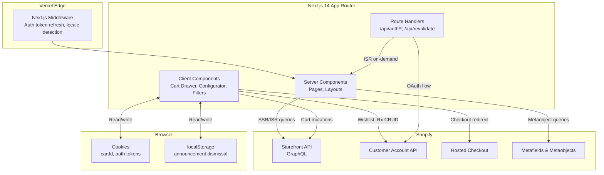
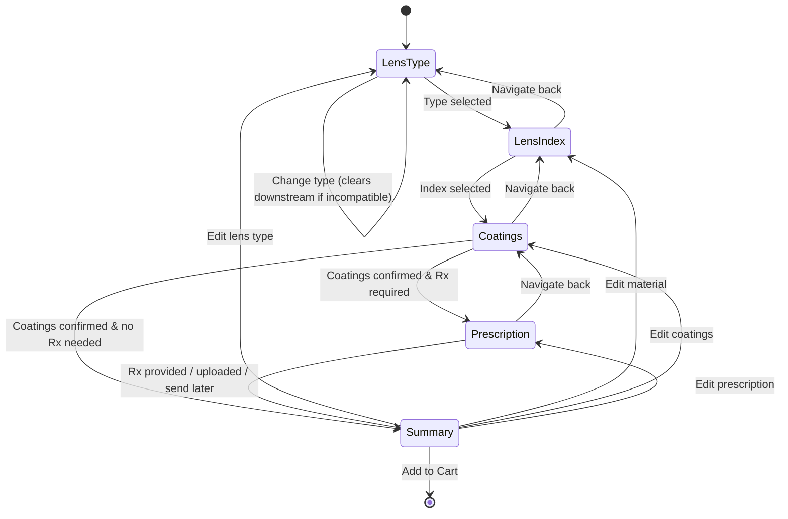

# Design Document — Lunettiq Headless Shopify Storefront

## Overview

This design describes the architecture for Lunettiq's headless e-commerce storefront: a Next.js 14 (App Router) frontend consuming the Shopify Storefront API (GraphQL) for product/collection/cart data and the Shopify Customer Account API for authenticated user features (wishlist, prescriptions, loyalty). The application deploys on Vercel with SSR/ISR for SEO-critical pages and client-side interactivity for the cart drawer, lens configurator, and filter UI.

### Key Design Decisions

1. **Shopify as single source of truth** — All product, pricing, inventory, cart, and checkout data lives in Shopify. The frontend never caches prices or inventory locally.
2. **Metafields/Metaobjects as CMS** — Editorial content (hero, announcement bar, editorial panels, store locations, eye test CTA) is managed via Shopify Metaobjects. No separate CMS.
3. **Shopify-hosted checkout** — No custom checkout UI. The cart's `checkoutUrl` redirects to Shopify's hosted checkout.
4. **Lens Configurator as client-side state machine** — The multi-step configurator runs entirely client-side with React state. Selections are serialized as cart line item attributes on add-to-cart.
5. **Cookie-based cart persistence** — The Shopify cart ID is stored in a browser cookie, enabling cart persistence across sessions.
6. **OAuth via Shopify Unified Login** — Authentication uses Shopify's Customer Account API OAuth flow. Tokens stored in secure HTTP-only cookies.

## Architecture

### High-Level System Diagram



### Rendering Strategy

| Route Pattern | Strategy | Revalidation |
|---|---|---|
| `/` (homepage) | ISR | 60s (on-demand via webhook) |
| `/collections/[handle]` | ISR | 60s |
| `/products/[handle]` | ISR | 60s |
| `/pages/[handle]` | ISR | 300s |
| `/journal/[slug]` | ISR | 300s |
| `/account` | SSR (dynamic) | No cache (auth-gated) |
| `/account/*` | SSR (dynamic) | No cache |

### Data Flow Patterns

**Server-side (RSC):** Product pages, collection pages, and homepage fetch data from Shopify Storefront API at request time (ISR). Metaobject content (hero, editorial, announcement bar, store locations) is fetched server-side and passed as props.

**Client-side:** Cart mutations (add/update/remove lines), wishlist toggles, prescription CRUD, and filter/sort interactions happen client-side via fetch calls to the Storefront API or Customer Account API. The lens configurator is purely client-side state until add-to-cart.

## Components and Interfaces

### Application Shell

```
app/
├── layout.tsx                    # Root layout: AnnouncementBar + Header + Footer
├── page.tsx                      # Homepage
├── collections/
│   └── [handle]/page.tsx         # PLP
├── products/
│   └── [handle]/page.tsx         # PDP
├── pages/
│   └── [handle]/page.tsx         # Static pages (about, stores, eye-test)
├── journal/
│   └── [slug]/page.tsx           # Editorial articles
├── account/
│   ├── page.tsx                  # Account dashboard
│   ├── prescriptions/page.tsx    # Saved prescriptions
│   └── wishlist/page.tsx         # Favourites
├── api/
│   ├── auth/
│   │   ├── login/route.ts        # Initiate Shopify OAuth
│   │   ├── callback/route.ts     # OAuth callback handler
│   │   └── logout/route.ts       # Clear session
│   └── revalidate/route.ts       # ISR on-demand revalidation webhook
└── not-found.tsx                 # 404 page
```

### Component Hierarchy

```mermaid
graph TD
    RootLayout --> AnnouncementBar
    RootLayout --> Header
    RootLayout --> PageContent["Page Content (slot)"]
    RootLayout --> Footer
    RootLayout --> CartDrawer

    Header --> PrimaryNav
    Header --> SecondaryNav
    Header --> MobileNav
    PrimaryNav --> MegaNav

    SecondaryNav --> SearchTrigger
    SecondaryNav --> CartIcon
    SecondaryNav --> AccountIcon
    SecondaryNav --> StylistCTA

    Footer --> NewsletterSignup
    Footer --> FooterLinks
    Footer --> CurrencySelector
    Footer --> LanguageSelector

    subgraph "Homepage"
        HP[HomePage] --> HeroSection
        HP --> CategoryPanels
        HP --> ProductRow
        HP --> EditorialPanel
        HP --> StoreTeaser
    end

    subgraph "PLP"
        CLP[CollectionPage] --> FilterBar
        CLP --> ProductGrid
        CLP --> EditorialBreaks["Editorial Breaks"]
        CLP --> InfiniteScrollTrigger
        ProductGrid --> ProductCard
        ProductCard --> FavouriteIcon
    end

    subgraph "PDP"
        PDP[ProductPage] --> ImageGallery
        PDP --> ProductInfoPanel
        PDP --> ColourSelector
        PDP --> LensConfigurator
        PDP --> AddToCartButton
        PDP --> AccordionSections
        PDP --> OnFacesSection
        PDP --> Recommendations
        PDP --> EyeTestCTA

        LensConfigurator --> StepIndicator
        LensConfigurator --> LensTypeStep
        LensConfigurator --> LensIndexStep
        LensConfigurator --> CoatingsStep
        LensConfigurator --> PrescriptionStep
        LensConfigurator --> SunglassOptionsStep
        LensConfigurator --> ConfigSummary
        LensConfigurator --> RunningPriceTotal

        PrescriptionStep --> ManualRxForm
        PrescriptionStep --> RxImageUpload
        PrescriptionStep --> SendLaterOption
        PrescriptionStep --> SavedRxSelector
        PrescriptionStep --> PDMeasurementGuide
    end

    subgraph "Cart"
        CartDrawer --> CartLineItem
        CartDrawer --> CartSubtotal
        CartDrawer --> CheckoutButton
        CartDrawer --> EmptyCartMessage
    end

    subgraph "Account"
        AccountPage --> ProfileSection
        AccountPage --> OrderHistory
        AccountPage --> WishlistSection
        AccountPage --> PrescriptionsSection
        AccountPage --> LoyaltySection
    end
```

### Key Component Interfaces

```typescript
// --- Shopify API Client ---

interface ShopifyStorefrontClient {
  query<T>(query: string, variables?: Record<string, unknown>): Promise<T>;
}

// --- Cart Context (Client-side) ---

interface CartContextValue {
  cart: ShopifyCart | null;
  cartId: string | null;
  isOpen: boolean;
  isLoading: boolean;
  openCart: () => void;
  closeCart: () => void;
  addToCart: (variantId: string, quantity: number, attributes?: CartLineAttribute[]) => Promise<void>;
  updateLineItem: (lineId: string, quantity: number) => Promise<void>;
  removeLineItem: (lineId: string) => Promise<void>;
}

interface CartLineAttribute {
  key: string;  // e.g. "_lensType", "_lensIndex", "_coatings", "_rxStatus"
  value: string;
}

// --- Lens Configurator ---

type ConfiguratorStep = 'lensType' | 'lensIndex' | 'coatings' | 'prescription' | 'summary';

interface LensConfiguration {
  lensType: LensType | null;
  lensIndex: LensIndex | null;
  coatings: LensCoating[];
  sunOptions: SunLensOptions | null;
  prescription: PrescriptionData | null;
  prescriptionMethod: 'manual' | 'upload' | 'sendLater' | 'saved' | null;
}

type LensType = 'singleVision' | 'progressive' | 'nonPrescription' | 'readers'
  | 'prescriptionSun' | 'nonPrescriptionSun';

type LensIndex = '1.50' | '1.61' | '1.67' | '1.74' | 'polycarbonate';

type LensCoating = 'antiReflective' | 'antiReflectivePremium' | 'blueLight'
  | 'photochromic' | 'scratchResistant' | 'hydrophobic' | 'oleophobic';

interface SunLensOptions {
  tintColour: TintColour;
  polarized: boolean;
  mirrorCoating: MirrorCoating | null;
}

type TintColour = 'gray' | 'brown' | 'green' | 'rose' | 'yellow';
type MirrorCoating = 'silver' | 'gold' | 'blue' | 'green';

// --- Prescription ---

interface PrescriptionData {
  od: EyeRx;  // Right eye
  os: EyeRx;  // Left eye
  pd: number;  // Pupillary distance (50-80mm)
}

interface EyeRx {
  sphere: number;    // -20.00 to +20.00, 0.25 steps
  cylinder: number;  // -6.00 to +6.00, 0.25 steps
  axis: number;      // 1-180 degrees
  addPower?: number; // For progressive lenses
}

// --- Filter Bar ---

interface PLPFilters {
  shape: string[];
  colour: string[];
  material: string[];
  size: string[];
  sort: SortOption;
}

type SortOption = 'relevance' | 'price-asc' | 'price-desc' | 'newest';

// --- Wishlist ---

interface WishlistContextValue {
  items: string[];  // Product IDs
  isLoading: boolean;
  addToWishlist: (productId: string) => Promise<void>;
  removeFromWishlist: (productId: string) => Promise<void>;
  isInWishlist: (productId: string) => boolean;
}
```


### Shopify API Integration Layer

```typescript
// lib/shopify/storefront.ts — Singleton Storefront API client

const STOREFRONT_API_URL = `https://${process.env.NEXT_PUBLIC_SHOPIFY_STORE_DOMAIN}/api/2024-10/graphql.json`;
const STOREFRONT_ACCESS_TOKEN = process.env.SHOPIFY_STOREFRONT_ACCESS_TOKEN!;

async function storefrontFetch<T>(query: string, variables?: Record<string, unknown>): Promise<T> {
  // Implements retry with exponential backoff for 429/5xx responses (Req 27.3)
  // Access token is server-side only, never exposed to client bundle
}
```

**Query patterns:**

| Operation | API | Trigger | Caching |
|---|---|---|---|
| Fetch product by handle | Storefront API | SSR (PDP) | ISR 60s |
| Fetch collection products | Storefront API | SSR (PLP) | ISR 60s |
| Fetch product recommendations | Storefront API | SSR (PDP) | ISR 60s |
| Fetch Metaobjects (hero, editorial, stores) | Storefront API | SSR | ISR 60s–300s |
| Cart create / lines add / update / remove | Storefront API | Client-side mutation | No cache |
| Customer profile, orders, addresses | Customer Account API | SSR (account pages) | No cache |
| Wishlist read/write (customer metafield) | Customer Account API | Client-side mutation | No cache |
| Prescription CRUD (customer metafield) | Customer Account API | Client-side mutation | No cache |
| Loyalty tier read (customer metafield) | Customer Account API | SSR (account page) | No cache |

### State Management

| State Domain | Strategy | Persistence |
|---|---|---|
| Cart | React Context + Shopify Cart API | Cookie (cart ID) |
| Lens Configurator | `useReducer` within `LensConfigurator` component | None (ephemeral per PDP session) |
| Auth session | HTTP-only cookies (access + refresh tokens) | Cookie |
| Wishlist | React Context + Customer Account API metafield | Shopify customer metafield |
| Announcement dismissal | Component state | localStorage |
| PLP filters/sort | URL search params + component state | URL |
| Mobile nav open/close | Component state | None |
| Cart drawer open/close | Cart Context | None |

### Lens Configurator State Machine



**Step visibility rules:**
- Prescription step is shown only when `lensType` ∈ {singleVision, progressive, prescriptionSun}
- Sunglasses options (tint, polarization, mirror) are shown within the Coatings step when the product belongs to a sunglasses collection
- Readers show a magnification selector instead of the Prescription step
- Non-Prescription skips directly to Summary after Coatings

**Invalidation rules:**
- Changing `lensType` clears `lensIndex` if the new type is incompatible with the current index
- Changing `lensType` clears `prescription` if the new type doesn't require Rx
- Changing `lensIndex` does not affect coatings (all coatings are index-agnostic)

## Data Models

### Shopify Product Structure (Eyewear)

```
Product
├── title: string
├── handle: string
├── description: string (HTML)
├── priceRange: { minVariantPrice, maxVariantPrice }
├── options:
│   ├── Option 1: "Color" (e.g., "Matte Black", "Tortoise", "Crystal")
│   └── Option 2: "Lens" (e.g., "Clear", "Blue Light")
├── variants[]:
│   ├── id
│   ├── title: "Matte Black / Clear"
│   ├── price: Money
│   ├── availableForSale: boolean
│   ├── selectedOptions: [{ name: "Color", value }, { name: "Lens", value }]
│   └── image: Image
├── images[]: Image[]
├── metafields:
│   ├── custom.on_face_images: JSON (array of image URLs)
│   ├── custom.face_notes: string
│   ├── custom.material: string
│   ├── custom.origin: string
│   ├── custom.rx_compatible: boolean
│   ├── custom.bridge_width: number (mm)
│   ├── custom.lens_width: number (mm)
│   └── custom.temple_length: number (mm)
└── collections[]: Collection[]
```

### Shopify Cart Structure

```
Cart
├── id: string
├── checkoutUrl: string
├── lines[]:
│   ├── id: string
│   ├── quantity: number
│   ├── merchandise: ProductVariant
│   ├── attributes[]:
│   │   ├── { key: "_lensType", value: "singleVision" }
│   │   ├── { key: "_lensIndex", value: "1.67" }
│   │   ├── { key: "_coatings", value: "antiReflective,blueLight" }
│   │   ├── { key: "_sunTint", value: "gray" }
│   │   ├── { key: "_polarized", value: "true" }
│   │   ├── { key: "_mirrorCoating", value: "silver" }
│   │   ├── { key: "_rxStatus", value: "manual|upload|sendLater|saved|none" }
│   │   ├── { key: "_rxData", value: "{...serialized prescription}" }
│   │   ├── { key: "_lensUpgradePrice", value: "45.00" }
│   │   ├── { key: "_coatingsPrice", value: "30.00" }
│   │   └── { key: "_totalConfigPrice", value: "325.00" }
│   └── cost: { totalAmount }
└── cost: { subtotalAmount, totalAmount }
```

### Customer Metafield Data (Authenticated)

```
Customer
├── metafields:
│   ├── custom.wishlist: JSON
│   │   └── productIds: string[]
│   ├── custom.prescriptions: JSON
│   │   └── records[]:
│   │       ├── id: string (UUID)
│   │       ├── optometristName: string
│   │       ├── date: string (ISO date)
│   │       ├── od: { sphere, cylinder, axis, addPower? }
│   │       ├── os: { sphere, cylinder, axis, addPower? }
│   │       └── pd: number
│   └── custom.loyalty: JSON
│       ├── tier: "essential" | "cult" | "vault"
│       ├── points: number
│       └── nextTierThreshold: number
```

### Metaobject Schemas (CMS Content)

```
Metaobject: "announcement_bar"
├── message: single_line_text
├── link_text: single_line_text (optional)
├── link_url: url (optional)
└── active: boolean

Metaobject: "homepage_hero"
├── headline: single_line_text
├── image_left: file_reference (image)
├── image_right: file_reference (image)
├── cta_text: single_line_text
├── cta_link: url
└── active: boolean

Metaobject: "editorial_panel"
├── title: single_line_text
├── body: multi_line_text
├── image: file_reference (image)
├── link_url: url (optional)
└── placement: single_line_text ("homepage" | "plp" | "both")

Metaobject: "category_panel"
├── title: single_line_text
├── image: file_reference (image)
├── collection_handle: single_line_text
└── sort_order: number_integer

Metaobject: "store_location"
├── name: single_line_text
├── street_address: single_line_text
├── city: single_line_text
├── province: single_line_text
├── postal_code: single_line_text
├── phone: single_line_text
├── hours: json (object with day keys → hours strings)
├── map_url: url
└── active: boolean

Metaobject: "eye_test_cta"
├── heading: single_line_text
├── body: multi_line_text
├── cta_text: single_line_text
├── cta_link: url
└── image: file_reference (image, optional)

Metaobject: "lens_option"
├── type: single_line_text ("lensIndex" | "coating" | "tint" | "mirror")
├── name: single_line_text
├── description: multi_line_text
├── price: number_decimal
├── sort_order: number_integer
├── compatible_lens_types: list.single_line_text
└── active: boolean
```

### Pricing Model

Lens configurator pricing is additive:

```
Total = Frame Base Price (variant price)
      + Lens Index Upgrade (0 for Standard 1.50)
      + Σ(selected coating prices)
      + Polarization (if selected)
      + Mirror Coating (if selected)
```

Prices for lens options are stored in `lens_option` Metaobjects, fetched at PDP load time, and used client-side by the configurator. The total is computed client-side and passed as cart line attributes. The actual Shopify line item price is the variant price; the configurator add-ons are tracked as attributes for fulfillment and display purposes.


## Correctness Properties

*A property is a characteristic or behavior that should hold true across all valid executions of a system — essentially, a formal statement about what the system should do. Properties serve as the bridge between human-readable specifications and machine-verifiable correctness guarantees.*

### Property 1: Product Card Completeness

*For any* valid Shopify product data object containing an image, title, price, and colour options, rendering a product card SHALL produce output containing the product image, title, formatted price, and colour swatches.

**Validates: Requirements 9.2**

### Property 2: Editorial Panel Interval Placement

*For any* product grid with N products and a defined editorial interval K, the number of editorial panels injected SHALL equal floor(N / K), and each panel SHALL appear at position i*K for i in [1, floor(N/K)].

**Validates: Requirements 9.3**

### Property 3: Configurator Pricing Invariant

*For any* complete lens configuration (lens type, lens index, set of coatings, and optional sun options) with known prices, the running price total SHALL equal the frame base price plus the lens index upgrade price plus the sum of all selected coating prices plus polarization price (if selected) plus mirror coating price (if selected). The Configuration Summary itemised breakdown SHALL list each component and sum to the same total.

**Validates: Requirements 14.5, 14.6, 36.3**

### Property 4: Configurator Back-Navigation Preserves State

*For any* lens configurator state where steps S1 through Sn have been completed, navigating back to step Si and then forward again SHALL preserve all selections in steps Sj (j ≠ i) that are not invalidated by the change in Si.

**Validates: Requirements 14.7**

### Property 5: Configurator Invalidation Clears Downstream

*For any* lens configurator state where a visitor changes a selection in step Si that is incompatible with a selection in a later step Sj (j > i), the configurator SHALL clear the selection in Sj and prompt re-selection.

**Validates: Requirements 14.8**

### Property 6: Incomplete Configuration Disables Add to Cart

*For any* lens configurator state where at least one required step has not been completed, the Add to Cart button SHALL be disabled.

**Validates: Requirements 15.2**

### Property 7: Configuration Serialization to Cart Attributes

*For any* complete lens configuration, serializing it to cart line attributes and deserializing back SHALL produce an equivalent configuration. The serialized attributes SHALL include lens type, lens index, all selected coatings, sun options (if applicable), prescription status, and itemised price components.

**Validates: Requirements 15.3, 15.7**

### Property 8: Cart Drawer Line Item Completeness

*For any* set of cart line items, the Cart Drawer SHALL render each item displaying the product image, title, variant info, quantity, and line price.

**Validates: Requirements 20.1**

### Property 9: Cart Subtotal Invariant

*For any* cart containing N line items with known prices and quantities, the displayed subtotal SHALL equal the sum of (line price × quantity) for all line items.

**Validates: Requirements 20.5**

### Property 10: Prescription Cross-Field Validation

*For any* prescription input where Cylinder is non-zero and Axis is not provided, the validator SHALL reject the input. *For any* prescription input where all required fields (Sphere, Cylinder, Axis, PD) are within valid ranges and steps, and cross-field rules are satisfied, the validator SHALL accept the input.

**Validates: Requirements 24.3, 32.8**

### Property 11: Email Validation

*For any* string that conforms to a valid email format (local@domain with valid characters), the newsletter email validator SHALL accept it. *For any* string that does not conform, the validator SHALL reject it.

**Validates: Requirements 26.3**

### Property 12: API Retry with Exponential Backoff

*For any* sequence of Storefront API responses containing 429 (rate limit) status codes followed by a 200 success, the retry logic SHALL eventually return the successful response. The delay between retries SHALL increase exponentially. After exceeding the maximum retry count, the logic SHALL throw a retriable error.

**Validates: Requirements 27.3**

### Property 13: Prescription Field-Level Range and Step Validation

*For any* numeric value, the Sphere validator SHALL accept values in [-20.00, +20.00] at 0.25 increments and reject all others. The Cylinder validator SHALL accept values in [-6.00, +6.00] at 0.25 increments and reject all others. The Axis validator SHALL accept integers in [1, 180] and reject all others. The PD validator SHALL accept values in [50, 80] at 0.5 increments and reject all others.

**Validates: Requirements 32.4, 32.5, 32.6, 32.7**

### Property 14: Mutual Exclusivity of Lens Coatings

*For any* set of selected lens coatings, if coating A and coating B are defined as mutually exclusive, then selecting A SHALL disable B and selecting B SHALL disable A. It SHALL be impossible for both to be in the selected set simultaneously.

**Validates: Requirements 34.7**

## Error Handling

### API Error Strategy

| Error Source | Handling | User Experience |
|---|---|---|
| Storefront API query failure (product/collection) | Catch in server component, render fallback | "Unable to load products. Please try again." with retry button |
| Storefront API 429 (rate limit) | Exponential backoff retry (max 3 attempts) | Transparent to user; error shown only after all retries fail |
| Storefront API cart mutation failure | Catch in client, show toast notification | "Could not update cart. Please try again." |
| Customer Account API failure | Catch in server/client, show inline error | "Unable to load account data." on account pages |
| OAuth flow failure or cancellation | Redirect back to previous page | No error shown (Req 22.6) |
| Invalid collection handle (404) | Return `notFound()` from server component | Next.js 404 page |
| Invalid product handle (404) | Return `notFound()` from server component | Next.js 404 page |
| Newsletter signup invalid email | Client-side validation before submit | Inline validation error below input |
| Prescription validation failure | Client-side validation on form submit | Inline field-level error messages |
| Image load failure | Next.js Image `onError` → placeholder | Placeholder image displayed |
| Metaobject query returns empty | Conditional render (don't show section) | Section simply not rendered |

### Cart Error Recovery

- If `cartId` cookie references a deleted/expired cart, the next mutation will fail. On failure, clear the cookie and create a new cart transparently.
- Cart mutations use optimistic UI updates with rollback on failure.

### Prescription Validation Error Messages

| Field | Condition | Message |
|---|---|---|
| Sphere | Out of range | "Sphere must be between -20.00 and +20.00" |
| Sphere | Invalid step | "Sphere must be in 0.25 increments" |
| Cylinder | Out of range | "Cylinder must be between -6.00 and +6.00" |
| Cylinder | Invalid step | "Cylinder must be in 0.25 increments" |
| Axis | Missing when Cylinder set | "Axis is required when Cylinder is specified" |
| Axis | Out of range | "Axis must be between 1 and 180" |
| PD | Out of range | "PD must be between 50 and 80 mm" |
| PD | Invalid step | "PD must be in 0.5 increments" |

## Testing Strategy

### Unit Tests (Example-Based)

Unit tests cover specific UI rendering, navigation, and interaction scenarios:

- **Navigation:** Verify each nav link routes to the correct path (Reqs 2, 3, 4)
- **Announcement Bar:** Dismiss behavior, localStorage persistence, conditional render (Req 1)
- **Homepage sections:** Hero, category panels, product rows, editorial panels render with mock data (Reqs 5–8)
- **PDP components:** Image gallery updates on colour change, accordion expand/collapse, On Faces conditional render (Reqs 11, 13, 16, 17)
- **Lens Configurator steps:** Step transitions, conditional step visibility (sunglasses, readers, non-Rx), disabled options (Req 14)
- **Cart Drawer:** Open/close behavior, empty cart state, checkout redirect (Reqs 20, 21)
- **Account pages:** Profile display, wishlist toggle, prescription list, loyalty tier display (Reqs 22–25)
- **Footer:** Newsletter form, currency/language selectors (Req 26)
- **Responsive:** Mobile nav, PLP grid column changes, touch targets (Reqs 4, 29)
- **404 page:** Invalid routes render not-found (Req 28.7)

### Property-Based Tests

Property-based tests use `fast-check` (TypeScript PBT library) with a minimum of 100 iterations per property. Each test is tagged with its design property reference.

| Property | What It Tests | Tag |
|---|---|---|
| Property 1 | Product card renders all required fields for any product data | Feature: lunettiq-headless-shopify, Property 1: Product card completeness |
| Property 2 | Editorial panels placed at correct grid intervals | Feature: lunettiq-headless-shopify, Property 2: Editorial panel interval placement |
| Property 3 | Running price total = frame + Σ(upgrades) for any config | Feature: lunettiq-headless-shopify, Property 3: Configurator pricing invariant |
| Property 4 | Back-navigation preserves non-invalidated selections | Feature: lunettiq-headless-shopify, Property 4: Back-navigation preserves state |
| Property 5 | Incompatible change clears downstream selections | Feature: lunettiq-headless-shopify, Property 5: Invalidation clears downstream |
| Property 6 | Incomplete config → Add to Cart disabled | Feature: lunettiq-headless-shopify, Property 6: Incomplete config disables cart |
| Property 7 | Config serialization round-trip to cart attributes | Feature: lunettiq-headless-shopify, Property 7: Config serialization round-trip |
| Property 8 | Cart drawer renders all fields for any line items | Feature: lunettiq-headless-shopify, Property 8: Cart drawer line item completeness |
| Property 9 | Cart subtotal = Σ(line price × quantity) | Feature: lunettiq-headless-shopify, Property 9: Cart subtotal invariant |
| Property 10 | Prescription cross-field validation (Cylinder requires Axis) | Feature: lunettiq-headless-shopify, Property 10: Prescription cross-field validation |
| Property 11 | Email validation accepts valid, rejects invalid | Feature: lunettiq-headless-shopify, Property 11: Email validation |
| Property 12 | Retry logic handles 429s with exponential backoff | Feature: lunettiq-headless-shopify, Property 12: API retry backoff |
| Property 13 | Rx field validators enforce range + step constraints | Feature: lunettiq-headless-shopify, Property 13: Rx field validation |
| Property 14 | Mutually exclusive coatings cannot coexist | Feature: lunettiq-headless-shopify, Property 14: Coating mutual exclusivity |

### Integration Tests

Integration tests verify Shopify API interactions with mocked responses:

- **Storefront API:** Product queries return expected structure with metafields, collection queries with filters/sort, cart mutations (create, add, update, remove)
- **Customer Account API:** OAuth flow (login redirect, callback token exchange, logout), wishlist CRUD via customer metafield, prescription CRUD via customer metafield
- **Metaobject queries:** Announcement bar, hero, editorial panels, store locations, eye test CTA, lens options
- **Pagination:** Cursor-based infinite scroll loads next page correctly
- **ISR revalidation:** On-demand revalidation webhook triggers cache refresh

### Smoke Tests

- Vercel build succeeds (`npm run build:check`)
- All defined routes resolve (/, /collections/optical, /products/test-handle, /pages/about, /account)
- Environment variables are configured (Storefront API token, store domain)
- Storefront API client can execute a basic query
